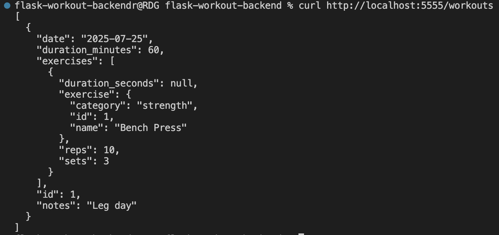

# Flask Workout Backend

A RESTful API to track workouts and exercises using Flask, SQLAlchemy & Marshmallow.

## Table of contents

- [Demo](#demo)
- [Installation](#installation)
- [Database Setup](#database-setup)
- [Running the server](#running-the-server)  
- [Testing](#testing)
- [API Endpoints](#api-endpoints)  

---

## Demo



## Installation  

```bash
git clone <YOUR-REPO-URL>
cd flask-workout-backend
pipenv install --dev
pipenv shell
```

## Database Setup

```bash
export FLASK_APP=server.app
flask db upgrade
python -m server.seed
```

## Running the server

```bash
flask run --port=5555
```

## Testing

```bash
pytest
```

## API Endpoints

- **GET** `/exercises`  
  List all exercises

- **GET** `/exercises/<id>`  
  View one exercise (with its workouts)

- **POST** `/exercises`  
  Create a new exercise

- **DELETE** `/exercises/<id>`  
  Delete an exercise

---

- **GET** `/workouts`  
  List all workouts

- **GET** `/workouts/<id>`  
  View one workout (with its exercises)

- **POST** `/workouts`  
  Create a new workout

- **DELETE** `/workouts/<id>`  
  Delete a workout

---

- **POST** `/workouts/<workout_id>/exercises/<exercise_id>/workout_exercises`  
  Add an exercise to a workout (include reps/sets or duration)
